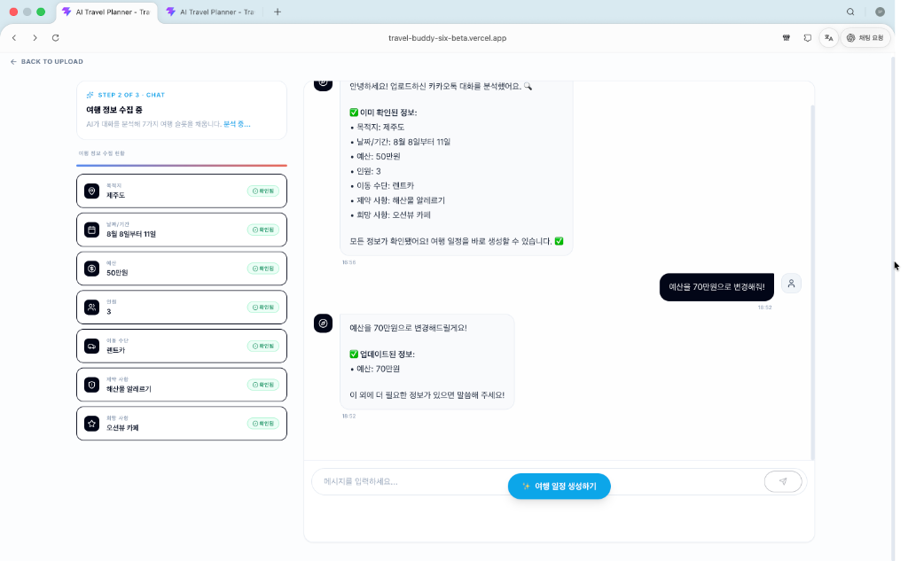
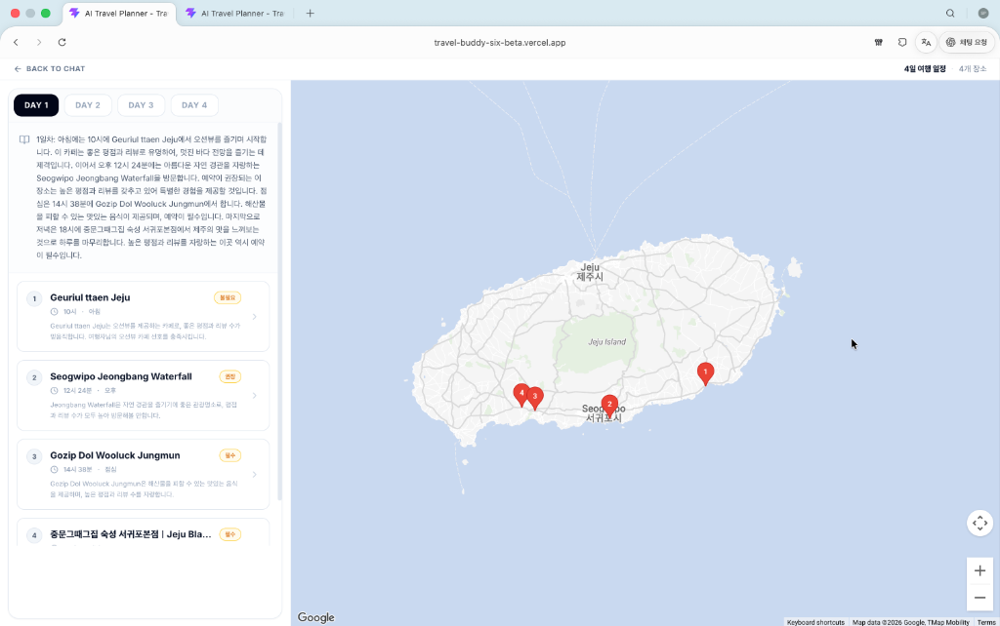

<div align="center">
  
  
  
  
</div>

<br />

<div align="center">
  <h1 align="center">✈️ Travel Buddy (AI Travel Planner)</h1>
  <p align="center">
    <strong>Turn your messy KakaoTalk chat history into a perfectly planned travel itinerary using AI!</strong>
  </p>
</div>

---

## 📑 Table of Contents

- [About The Project](#-about-the-project)
- [Screenshots](#-screenshots)
- [Key Features](#-key-features)
- [Tech Stack](#-tech-stack)
- [Getting Started](#-getting-started)
- [Application Flow](#-application-flow)
- [Contributing](#-contributing)
- [License](#-license)

---

## 📸 Screenshots

<div align="center">
  <h3>✨ AI Chat Interface & Travel Information Extraction</h3>
  
  <p><em>Interact with the AI to refine travel details extracted from KakaoTalk chats.</em></p>
  
  <br/>

  <h3>🗺️ Interactive Map & Day-by-Day Itinerary Generation</h3>
  
  <p><em>View your personalized day-by-day itinerary with an interactive Google Maps integration.</em></p>
</div>

---

## 💡 About The Project

**Travel Buddy** is an intelligent web application designed to eliminate the stress of travel planning. Planning a trip with friends often involves endless chat logs scattered with ideas about where to go, when to go, and what to eat. 

With Travel Buddy, you simply upload your **KakaoTalk conversation export**, and the AI does the heavy lifting: extracting your destination, dates, budget, headcount, preferred transport, and wishlists to craft the perfect personalized trip. It transforms chaotic chat histories into a beautifully structured, visual, and actionable travel itinerary.

## ✨ Key Features

- 💬 **KakaoTalk Chat Parsing**: Effortlessly upload a `.txt` or `.csv` export of your KakaoTalk chat. The app securely extracts text while respecting your privacy.
- 🤖 **AI Slot Extraction**: Automatically identifies the 7 key travel pillars: `Destination`, `Date`, `Budget`, `Headcount`, `Transport`, `Constraints`, and `Wishlist`.
- 🪄 **Interactive AI Chat Interface**: Missing some details? The built-in AI assistant will chat with you to clarify and finalize the parameters before locking in the plan.
- 📅 **Smart Itinerary Generation**: Uses LLMs to build a highly logical, day-by-day travel plan, strictly adhering to your constraints (budget, time, travel distance).
- 🗺 **Interactive Map & Routes**: Visualizes your daily routes using the **Google Maps API**. Click on markers to view rich detail cards (photos, ratings, hours) and see precise driving/transit distances on the map.
- 💎 **Premium Modern UI**: Built with React and Tailwind CSS, featuring beautiful micro-animations, glassmorphism, responsive layouts, and a buttery-smooth user experience.

---

## 🛠 Tech Stack

| Category | Technology |
| :--- | :--- |
| **Frontend Framework** | React 19, Vite, TypeScript |
| **Styling & UI** | Tailwind CSS, Lucide React Icons |
| **State Management** | Zustand |
| **Routing** | React Router DOM |
| **Map Engine** | `@react-google-maps/api` |
| **Network** | Axios |

---

## 🚀 Getting Started

### Prerequisites
- Node.js installed on your machine
- Google Maps API Key
- OpenAI API Key (or equivalent LLM)

### Installation

1. **Clone the repository:**
   ```bash
   git clone https://github.com/speter0601/KHUDA_advanced.git
   cd KHUDA_advanced
   ```

2. **Install dependencies:**
   ```bash
   npm install
   ```

3. **Configure Environment Variables:**
   Create a `.env` file in the root directory:
   ```env
   VITE_BACKEND_API_URL=http://127.0.0.1:8080
   VITE_LLM_API_URL=https://api.openai.com/v1
   VITE_LLM_MODEL=gpt-4o-mini
   VITE_LLM_API_KEY=your_openai_api_key_here
   VITE_GOOGLE_MAPS_API_KEY=your_google_maps_api_key_here
   VITE_USE_MOCK=false
   ```

4. **Start the development server:**
   ```bash
   npm run dev
   ```

---

## 🗺 Application Flow

1. **Upload Phase** 📤<br/>
   Users drag-and-drop their KakaoTalk chat export file. The app parses it cleanly on the client-side.
   
2. **Chat & Slot Extraction** 💬<br/>
   The AI reviews the chat context and fills out travel parameters. Users can chat directly with the AI to refine or fill missing information.

3. **Plan Generation** 🪄<br/>
   Once all parameters are confirmed, an itinerary is generated containing day-by-day narratives and a structured list of visited places.

4. **Map & Explore** 📍<br/>
   The generated plan is displayed on a beautifully styled vertical timeline and an interactive Google Map with rich route visualization.

---

## 🤝 Contributing

Contributions, issues, and feature requests are welcome! Feel free to check the [issues page](https://github.com/speter0601/KHUDA_advanced/issues).

## 📝 License

This project is licensed under the **MIT License**.
